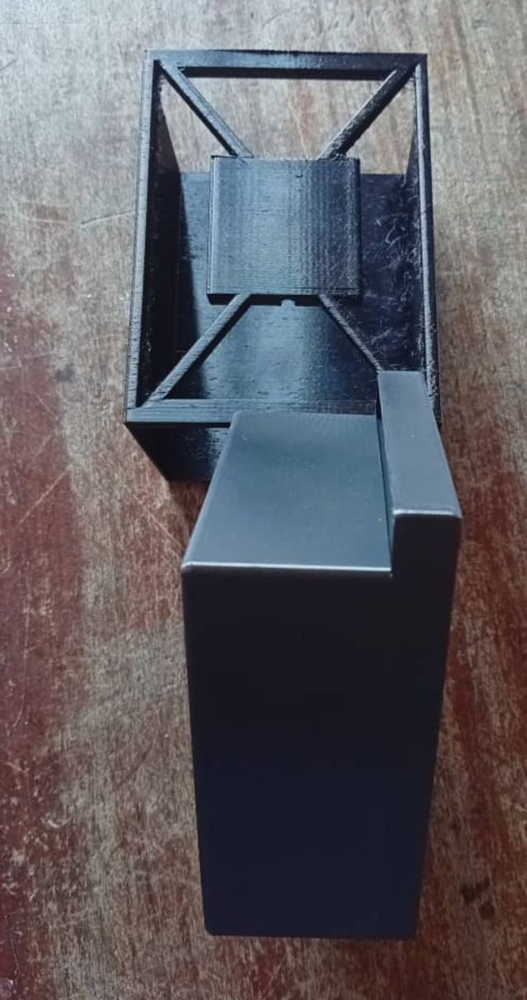

# Journal du 10 septembre 2026 (rédigé par Magnoudéwa ALABA)

## Fait aujourd'hui
Mise en place - information sur le programme de la journee
- Travail de groupe sur le projet
- De la comception du casier avec fusion 360 a l'impression
## Appris
- Esquisse de notre prototype d'armoire
- Implimenté le tirror en 3D selon les premiere mesure
- Dimensionnement du tirror
- Travailler sur Kicad pour trouver les composants
- Connection ou liaison entre les composants
- Modélisation d'un prototype d'armoire et du tirroir
- 
- 
- La impression des  deux pièces
- 
- Reverification des dimenssion
- rediemssionnement de l'armoire
## Raté, puis corrigé
- On à raté les dimention ce qui fait que le casier flotte dans l'armoire demander de l'aide aux formateurs pour évoluer

## Décidé
- Continue avec l'esquisse du tiroir et de l'armoire

## A faire demain
- Continuer avec le skech et la partie electronique voire possible les composantes qu'on eux avoire