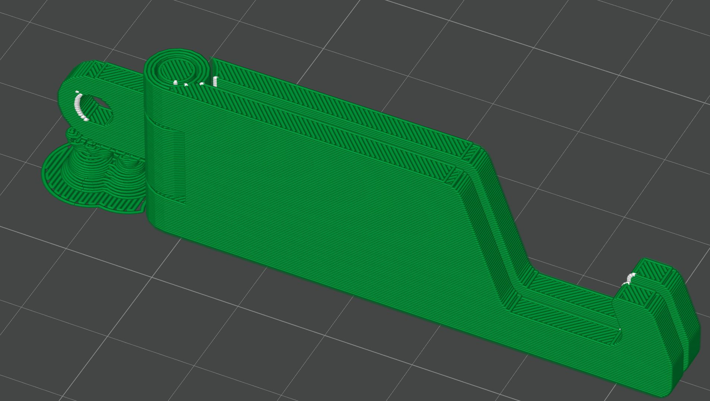
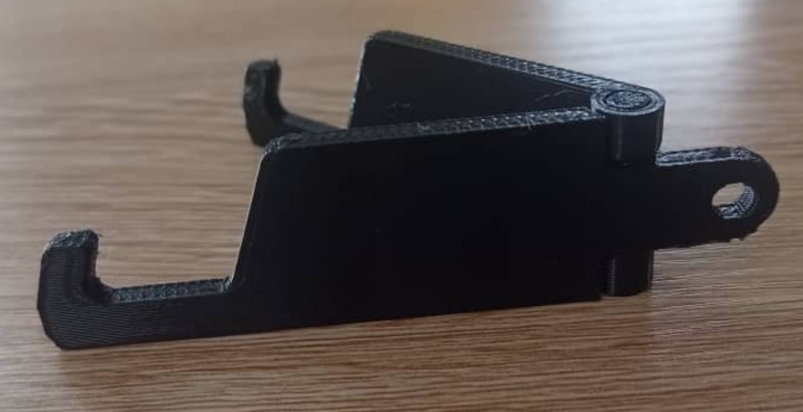

# Journal du 28 août 2026 (rédigé par Magnoudéwa ALABA)

## Fait aujourd'hui
- Mise en place - information sur le programme de la journee
- Passage dans chaque Atelier pour 45 minute
et terminer avec 4h de comment organiser et planifier la realisation des projets
- Completer la configuration Autodesk Fusion
- Manipulation du logiciel mBlock 
- impression en 3D

## Appris

### Sale projet
- Completer la configuration Autodesk Fusion
- organiser et planifier la realisation des projets
-Design Thinking et Méthode spirale
- De l'empathie a tester la realisation

### Atelier d'electronique 
- Manipulation de mBlock
- utilisation de cyberPi
- Code de lumiere pour un enfant qui demande d'avoir les lumiere eteinte une foix qu'il fait nuit

### l'impression 3DFDM
- Pratique du logiciel bambou stiduo
- Comment parametre les pouvoir imprimé
- 
- impression d'un support de téléphone
- 

### La découpe laser
- creation des cartes d'invitations
- Chacun cree ce qu'il veux imprimer (quartier libre)

## Raté, puis corrigé
- Nean
## Décidé
- Nean

## A faire demain
- Preparer 

