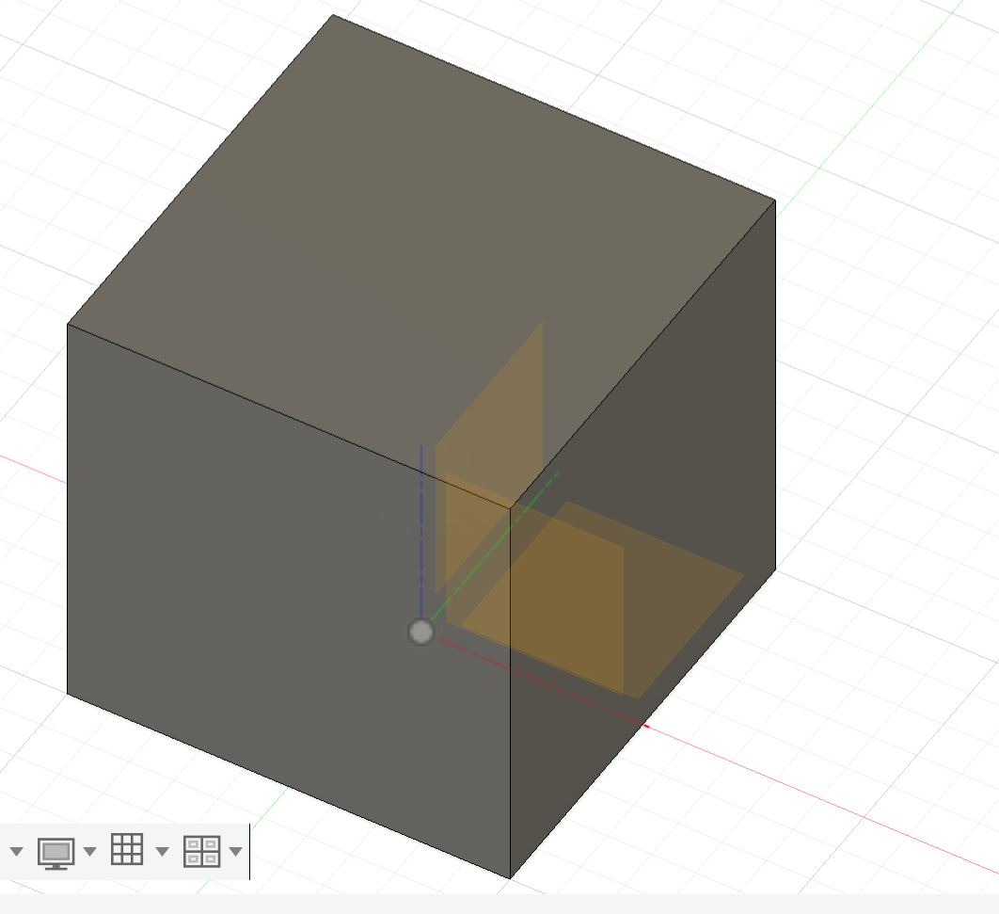

# Journal du 01 septembre 2026 (rédigé par Magnoudéwa ALABA)

## Fait aujourd'hui
- Mise en place - information sur le programme de la journée
- Modelisation 3D
- Atelier d'electronique 
- Atelier decoupe laser
## Appris
- Creation d'un cylindre avec differentes methode
- creation d'autre shape
-
- Dimensionnement des objets
- Comment bloquer les mouvements des objets
- Cree les zones de travail 
- le rendre plus extéthique
- Maîtrise de breadbord SK10
- Cablage d'un circuit
- l'impression DTF avec XTool

## Raté, puis corrigé
nean

## Décidé
nean

## A faire demain