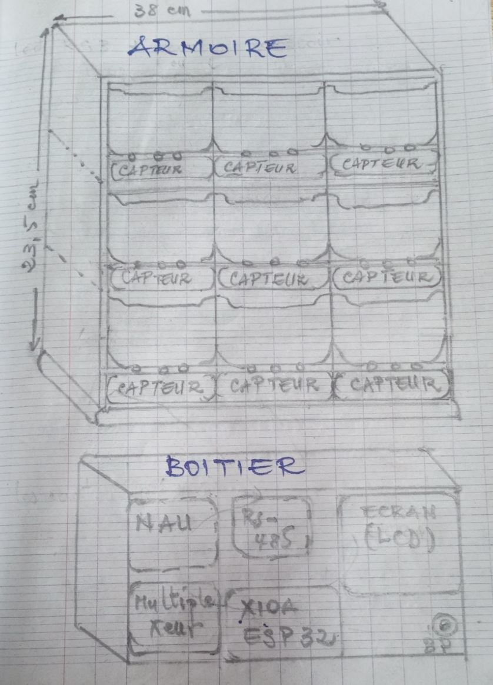
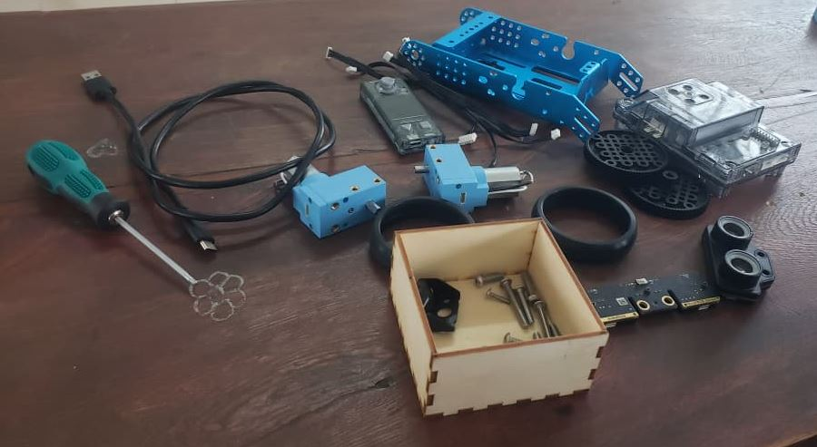
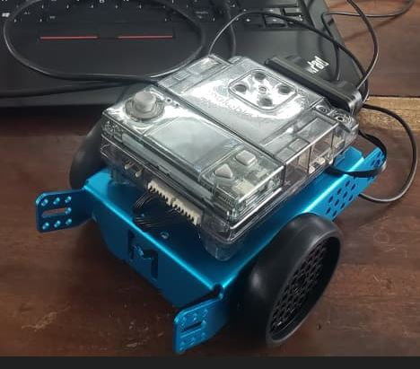
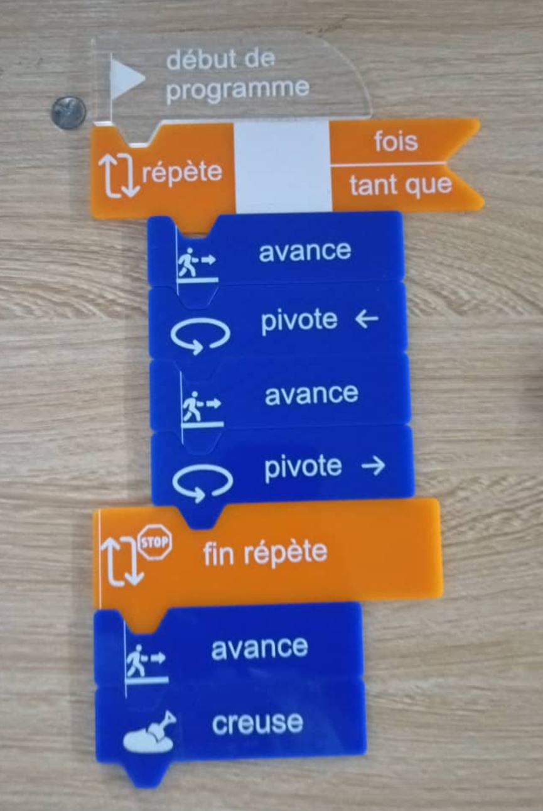

# Journal du 02 septembre 2026 (rédigé par Magnoudéwa ALABA)

## Fait aujourd'hui
- Consolidation du Projet du *Groupe 15* 
- Electronique Avancé
- Les Bases de l'algorithme débranché
## Appris
- Conception d'une esquisse préparatoire

- choix des composants
-NAU7802: cellule de pesée 
-Multiplexeur  
-Transceiver (RS-485) 
-Microcontrôleur (XIAO ESP32) 
-Ecran OLED  Affichage
-LED RGB
- Montage d'un robot mobile mBot
- 
- 
- Principe de l'algorithmique débranchée 
- Comprendre la logique d'un programme
- cree un code avec la logique
- 
## Raté, puis corrigé
- le robot ne marche pas suite a la batterie qui est déchargé.
- un temps pour charger et le robot a commencer par marcher
## Décidé
néan

## A faire demain
- Les Bases de la programmation Python