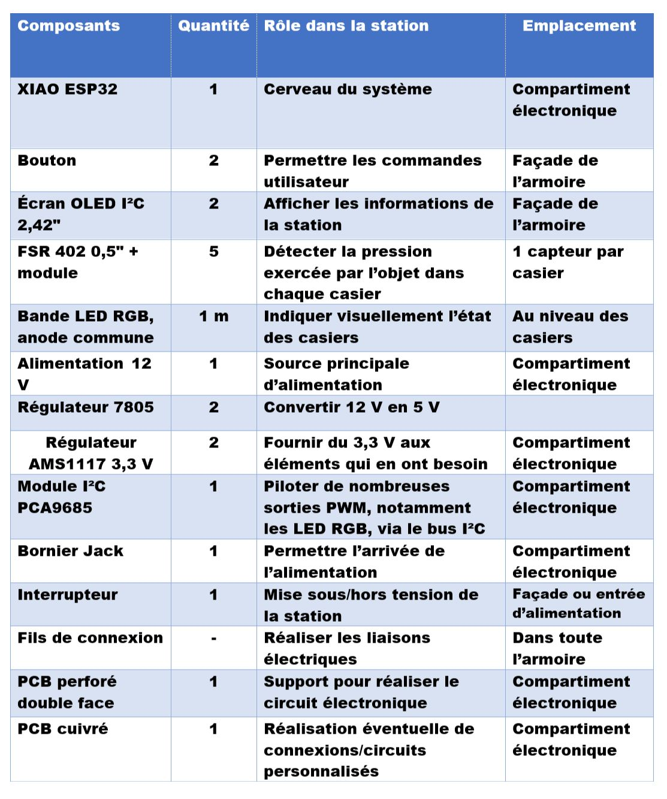

# Journal du 03 septembre 2026 (rédigé par Magnoudéwa ALABA)

## Fait aujourd'hui
- Mise en place 
- Information sur le programme du jour.
- Design Thinking
- Travailler en groupe (groupe 15)
- Les bases de la programmation Python pour les Fabmanagers

## Appris
- Finalisation du choix des composants
- 
- Fonctionnement et roles de chaque composant
- Les bases de la programmation Python
-Pourquoi python? qu'est ce que python?
-python au fablab - les variables 
-l'environement de travail: thonny / micropython

## Raté, puis corrigé
néan

## Décidé
néan

## A faire demain