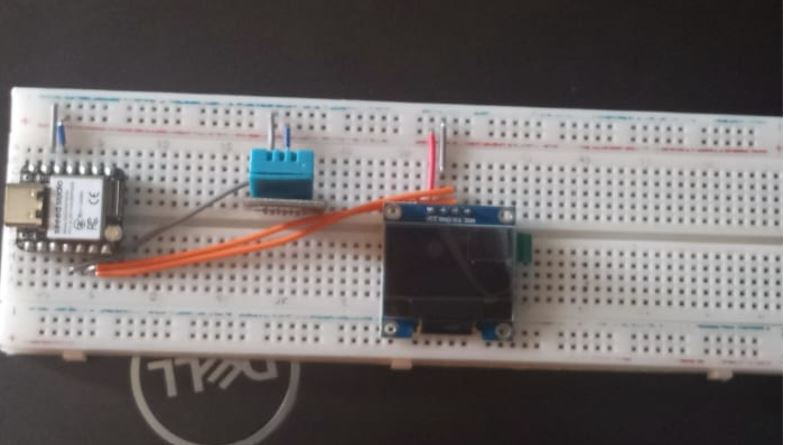
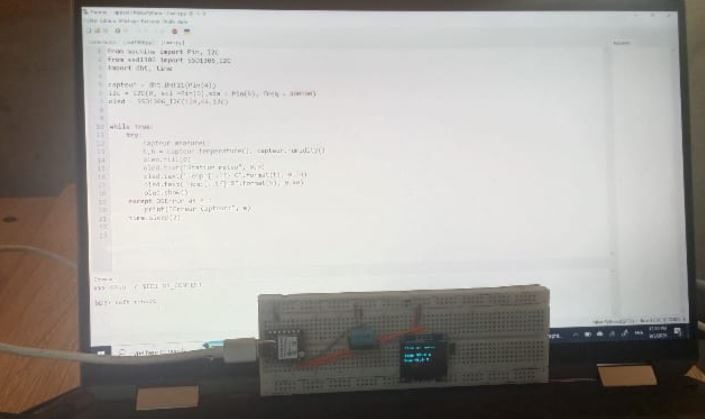

# Journal du 05 septembre 2026 (rédigé par Magnoudéwa ALABA)

## Fait aujourd'hui
- Mise en place 
- Information sur le programme du jour.
- Travailler sur SMART WEATHER STATION par groupe de 4 personnes Group 15
- Utilisation du Microcontroleur XIAO ESP32 en collaboration avec Micropython       
- Matériel nécessaire    
- Comparaison des plaquet SK10 
- Comparaison des capteurs de temperature DHT22 et DHT11 
- Schéma de câblage
- Verification de l'installation et de la configuration de Thonny   
- Installation des bibliothèques  
## Appris
- Connexion entre les composants electronique
- le materiel : 
-Le capteur de température DHT22 et DHT11 
-l'écran OLED.
-Le microcontrôleur XIAO ESP32-S3 
-MicroPython: Thonny
- Cablage du schemas au circuit
- 
- Connectivité entre XIA0 et Micropython
- 

## Raté, puis corrigé
- Compilation erronné 
- problême lié à la connexion  de la plaquet SK10.

## Décidé
- Verifier les connections des plaquets avec l'appareil de mesure

## A faire demain
- Travailer a la maison