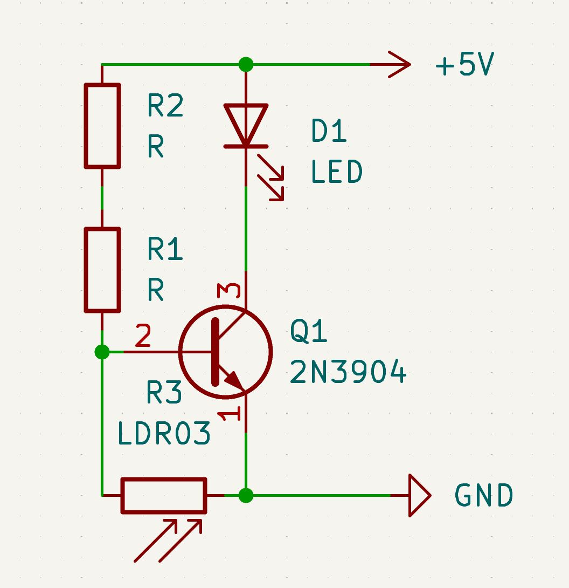
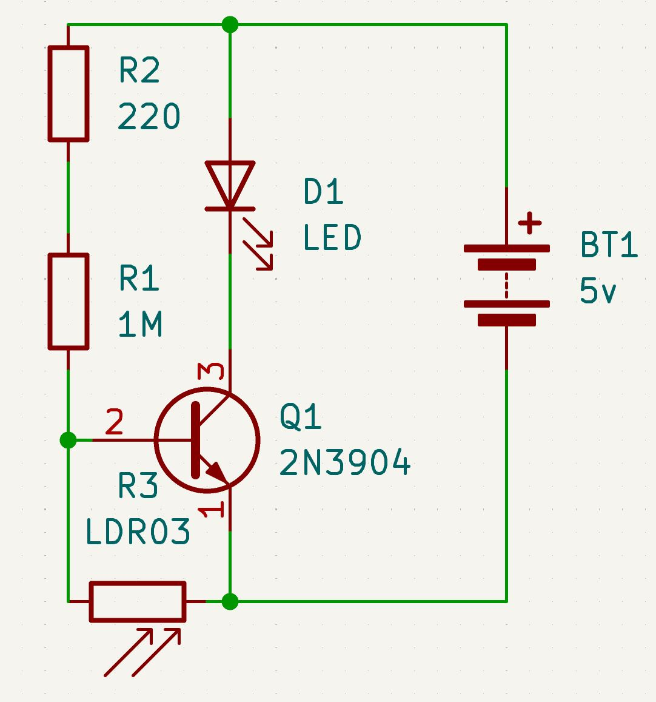
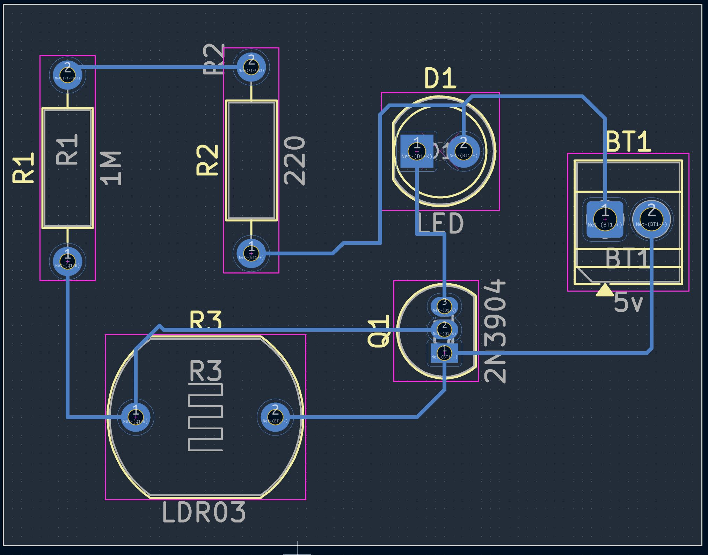
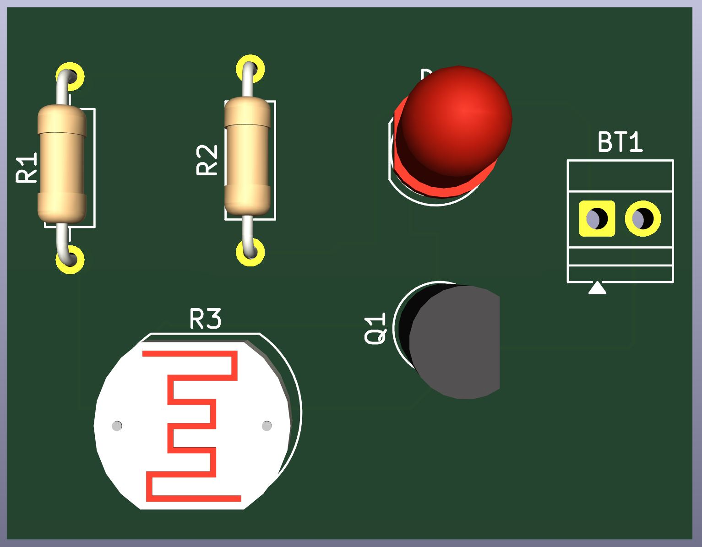

# Journal du 07 septembrer 2026 (rédigé par Magnoudéwa ALABA)

## Fait aujourd'hui
- Mise en place - information sur le programme de la journée
- Mise aux point et amelioration de la collaboration
- Installation du logiciel KiCad10.0

## Appris
- utilisation du logiciel KiCad10.0
- Comprendre le PCB
- importation des composants et comment les connectés
- 
- image correct apres check up
-
- comment choisir les composants pour faire la maquete selon leur port de connexion
- connection avec le cuivre 
- 
- 
## Raté, puis corrigé
- on n'a pas connecté le systeme a la battery on a eu une erreur après la connexion on a la même erreur jusqu'a ce qu'on éfface les pin et la pas d'erreure

## Décidé
- Verifier toujours le system en utilisant le checmk list

## A faire demain
- Rechercher le symbol des composants