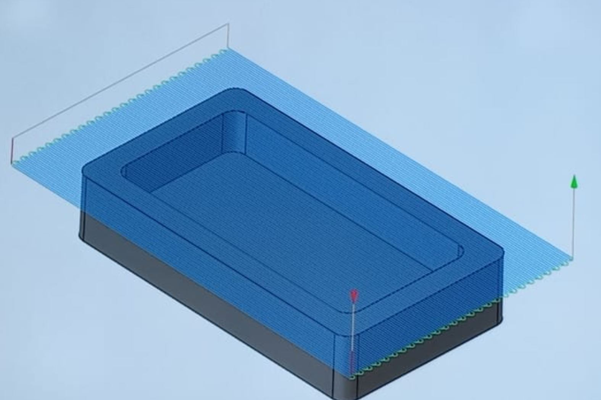

# Journal du 08 septembre 2026 (rédigé par Magnoudéwa ALABA)

## Fait aujourd'hui
Mise en place - information sur le programme de la journee
- Travail de groupe sur le projet
- De la comception à la piéce usinée avec fusion 360
## Appris
- Esquisse de notre prototype d'armoire
- Implimenté le casier en 3D selon les premiere mesure
- Dimensionnement des armoires

- Modélisation d'un prototype d'armoire
- 
- La FAO (La fabrication Assistée par l'Ordinateur)
- La concepetion de la pièce
- 
- La Fabrication de la pièce
## Raté, puis corrigé
- On à plusieurs foix raté l'esquisse demander de l'aide aux formateurs pour évoluer

## Décidé
- Continue avec l'esquisse du tiroir

## A faire demain