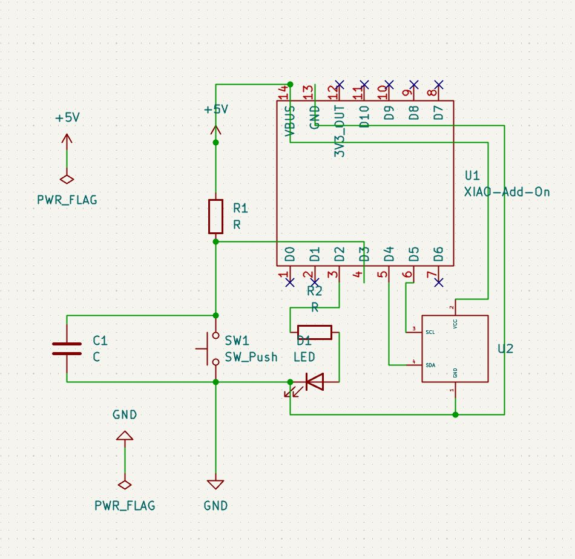

# Journal du 09 septembre 2026 (rédigé par Magnoudéwa ALABA)

## Fait aujourd'hui
- Mise en place - information sur le programme de la journee
- utilisation de Kicad 

## Appris
- Creation du schema en circuit
- 
- comment telecharger la librairie
- comment cree un composant qui n'est pas dans la librairie
- comment utiliser l'editeur de symbole et d'empreinte
- Les 6 fonctions de la programation qui permet de mettriser tout les languages
- Creation du circuit 
-- 
- Programmer en python pour le circuit dans Cree en kicad
- 

## Raté, puis corrigé
- creation du cadre coté cuivre etait raté plusieur foix par 80% du groupe le formateur a essayer de trouver la solution en dechochant un casier.

## Décidé
- Utiliser plusieur foix le logiciel pour mieux le metriser

## A faire demain
-Continuer avec nos projet