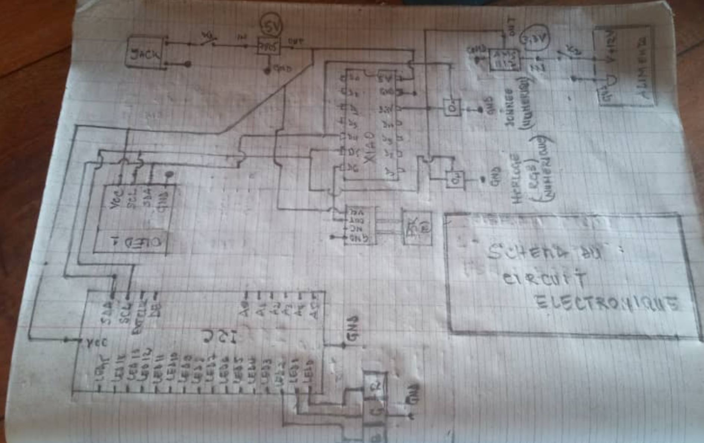

# Journal du 11 septembre 2026 (rédigé par Magnoudéwa ALABA)

## Fait aujourd'hui
Mise en place - information sur le programme de la journee
- Travail de groupe sur le projet
- Conception en fusion
## Appris
- Revoir l'esquisse de notre prototype d'armoire a nouveau
- Implimenter le casier en 3D sur des nouvelles mesure
- Redimensionnement des armoires
- Modélisation des prototypes 
- Schema du circuit électronique sur papier
- 

## Raté, puis corrigé
- On à encore raté l'impersion de l'armoire et du casier suite au fillament et a l'imprimante 

## Décidé
- Continuer avec l'esquisse du tiroir

## A faire demain