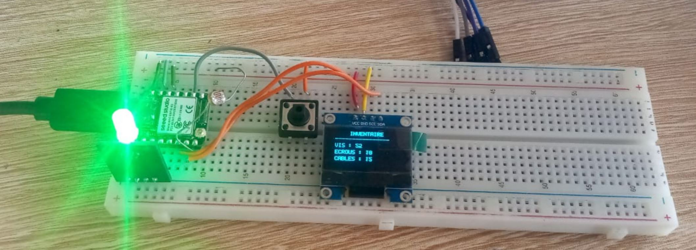

# Journal du 12 septembre 2026 (rédigé par Magnoudéwa ALABA)

## Fait aujourd'hui
- Mise en place - information sur le programme de la journee
- Travail en groupe sur le projet
- Commencer a ecrire le code sur thonny
- 
- Conception en fusion 360
## Appris
- Retravailler sur l'esquisse de notre prototype d'armoire a nouveau
- Implimenter le casier en 3D sur des nouvelles mesure
- Redimensionnement du cassier, armoir et debut du boitier
- Le choix de LED RGB afin de créer un trou sur l'Armoire pour y placer la LED
- Remodélisation des prototypes
- La Fabrication des pièces (armoir, tirroire)
- Verification du circuit électronique 
- réalisation du circuit électronique sur kicad
- 
- recherche du code à écrire et 1er test du circuit sur Breadboard SK10 (avec juste quelque composant)
- 

## Raté, puis corrigé
- On à raté plusieurs chose quelque partie du circuit 
- Echeck sur le bouton poussoir

## Décidé
- Continuer avec l'esquisse du tiroir
- essayer plusieur foix mais rien
## A faire demain
- Refaire encore