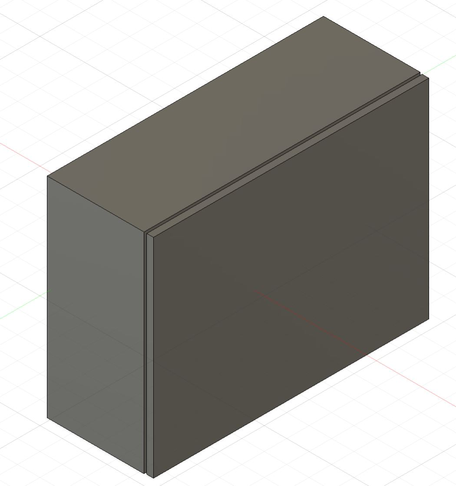
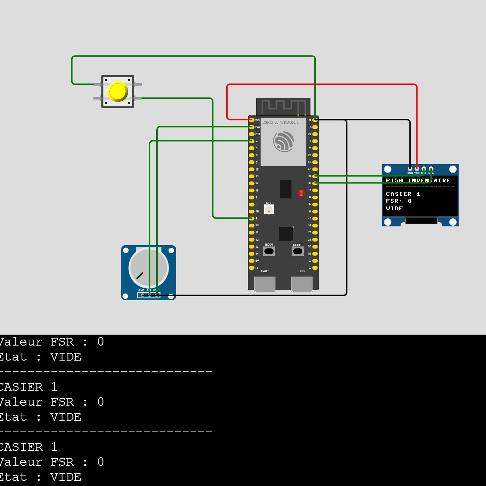
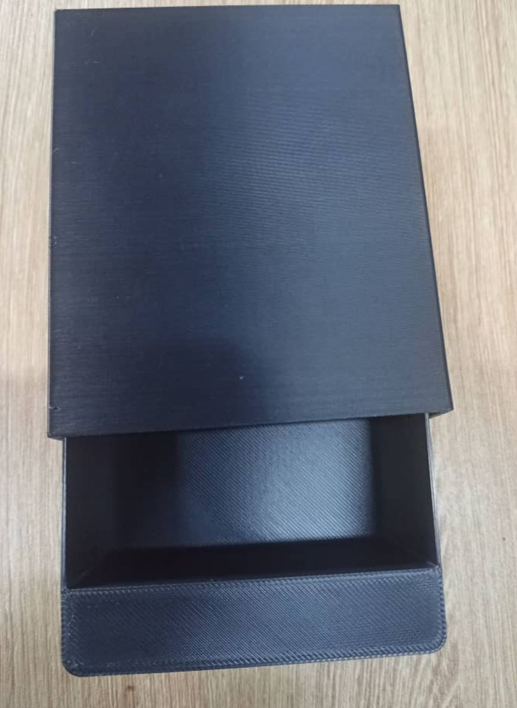

# Journal du 14 septembre 2026 (rédigé par Magnoudéwa ALABA)

## Fait aujourd'hui
- Travail de groupe sur le projet
- Impresion sur 3D
## Appris
- Redimensionnement du tiroir
- Dimensionnement du boitier
- 
-  impresion du casier en 3D avec les nouvelle mesure
- 
- réalisation du circuit électronique sur logiciel wokwi
- simulation du schema avec essaie de quelque composants sur wokwi
- 
- l'armoire et son tiroire
- 
- 

## Raté, puis corrigé
- comment faire le couvercle du boitier
## Décidé
- changement de projet suite au manque de materiel

## A faire demain