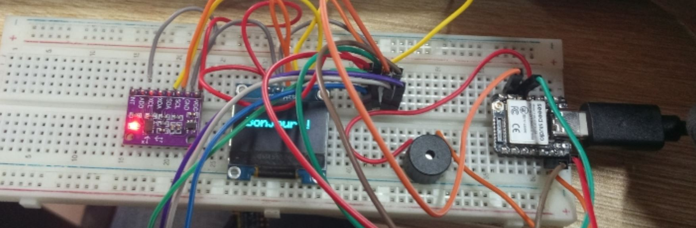
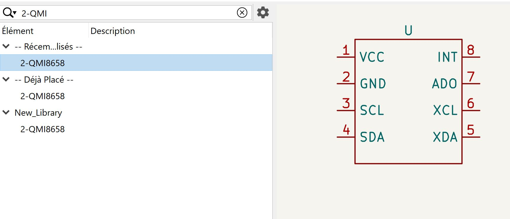
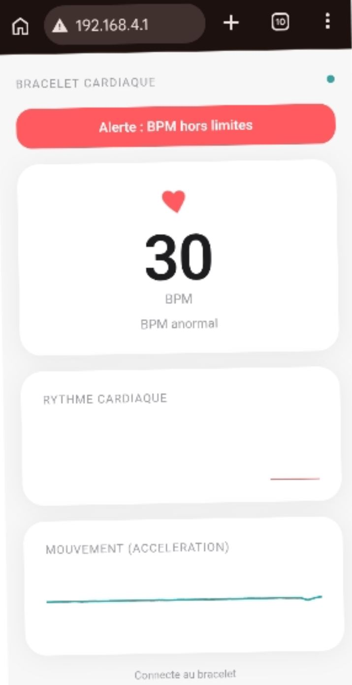

# Journal du 16 septembre 2026 (rédigé par Magnoudéwa ALABA)

## Fait aujourd'hui
- Mise en place.
- Travail de groupe sur le projet
- Briefing du nouveau Projet.

## Appris  
- réalisation du circuit électronique sur le logiciel Kicad constat de manque de composant dans le logiciel
- 
- simulation du circuit avec SK10
- On a testé le circuit avec le code MicroPython.
- afficher la fréquence cardiaque (BPM).
- 
- Desiner le symbole et les empreintes du composant dans le kicad (QMI 8658)

- Nommer le projet :SCHOOL AID SPORT HEART MONITOR (SASHM) un bracelet éducative centré sur la mesure de la fréquence cardiaque.
- Reprogrammer le système en MicroPython à l'aide de Thonny 
- Creation de l'interface d'une Application Web a utiliser 
- 
- l'adresse du site est http://192.168.4.1 directement générer par Wifi du microcontrôleur XIAO ESP32  au nom de  Cardio-Bra. Une fois connecté à ce Wifi, il nous conduit vers l'interface de l'application 

## Raté, puis corrigé 
- Cablage; dessin du symbole et empreinte

## Décidé
- continuer avec le nouveau projet

## A faire demain
- powerpoint; circuit final en Kicad flowchart