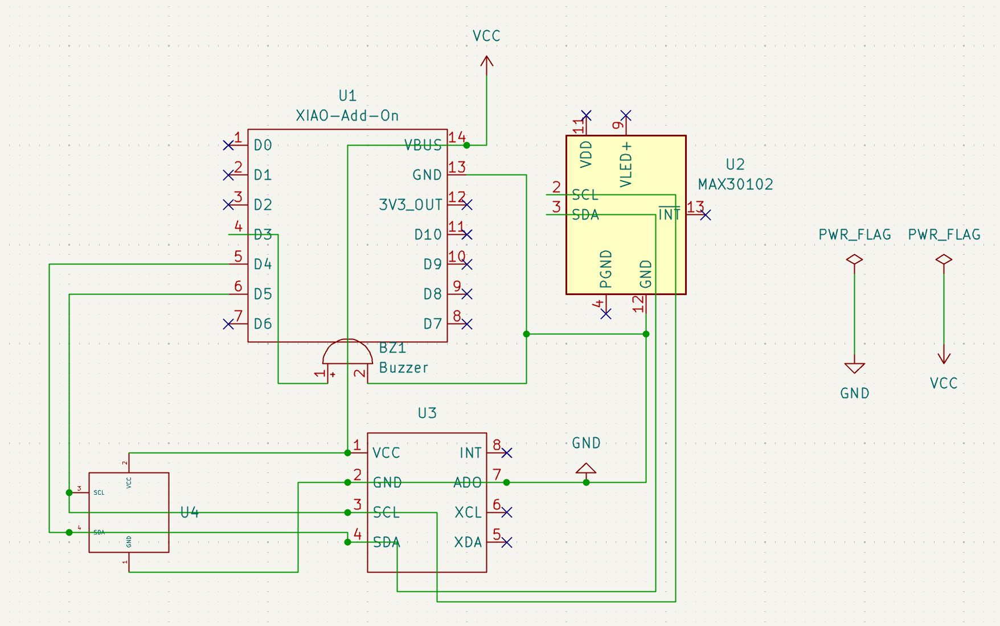
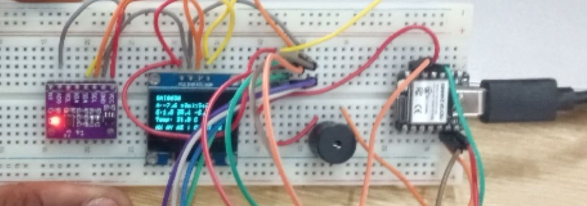
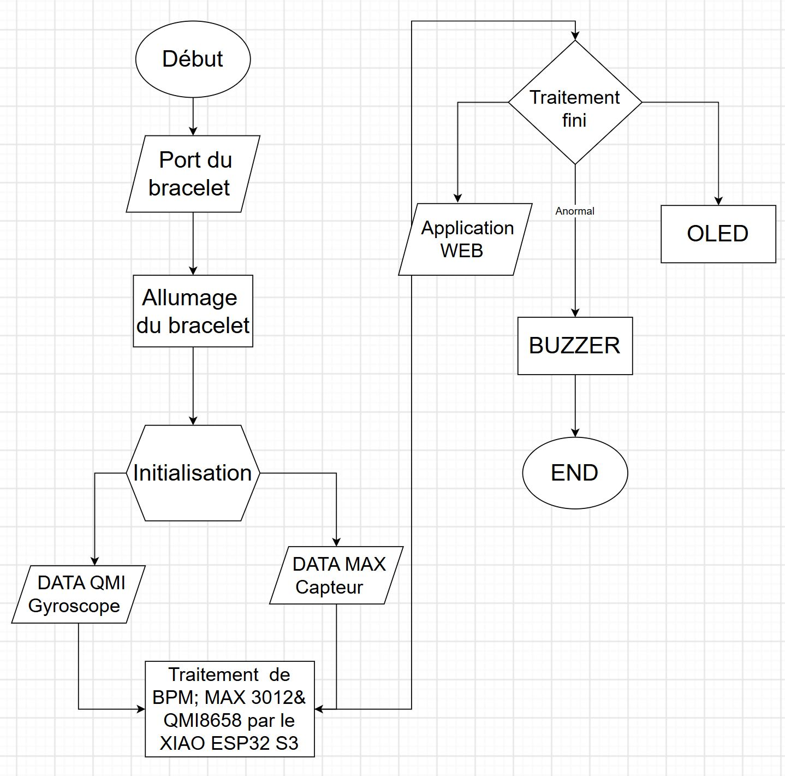

 Journal du 17 septembre 2026 (rédigé par Magnoudéwa ALABA)

## Fait aujourd'hui
- Mise en place.
- Travail de groupe sur le projet
- Briefing du nouveau Projet.
- partage des traveau
- Moi pour la finalisation du circuit danns kicad et le powerpoint...

## Appris  
- réalisation du circuit final électronique sur le logiciel Kicad.
- 
- simulation du circuit avec SK10
- 
- On a testé le circuit avec le code MicroPython.
- afficher la fréquence cardiaque (BPM).
- Renommer le projet :*SCHOOL AID SPORT HEART MONITOR (SASHM)* a *School Sports Heart Rate Monitor  (SSHRM)* 
- le titre du projet bracelet devient en francais un Moniteur Cardiaque pour le Sport en milieu Scolaire 
- Flow chart fait sur le site *flow drawio*
- 
- Preparation du powerpoint de demain 
- Impression avec resine avec l' aide du formateur et mes partenaires 
- soudure des composants sur la plaquete perforer cuivrer 

## Raté, puis corrigé 
- flowchart; impression du boitier;

## Décidé
- continuer avec le projet: *School Sports Heart Rate Monitor  (SSHRM)* 

## A faire demain
- presentation du projet 